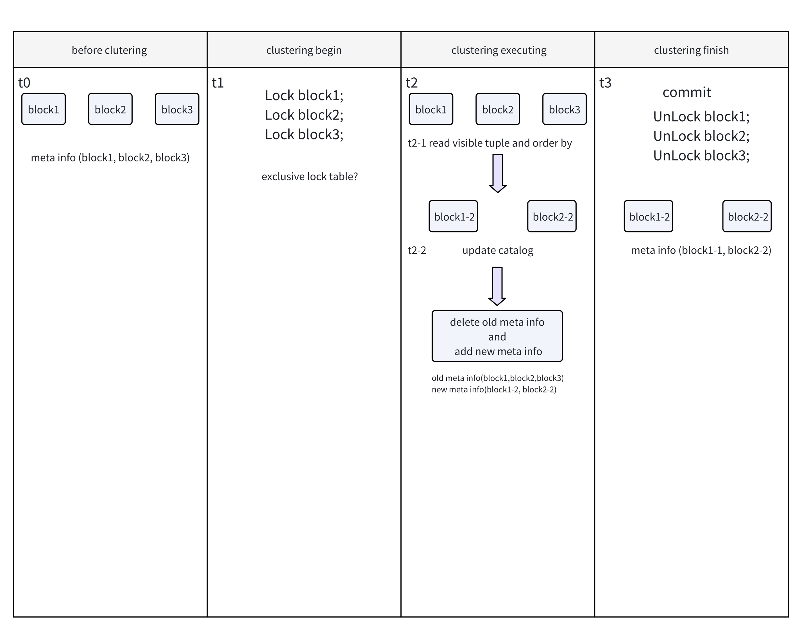

# PAX Clustering

# Overview

Cluster the data and bring 'adjacent data' together to improve query performance.

In Cloudberry, data is distributed on different segments according to distribution rules. For `CLUSTER`, data can only be sorted on segments according to cluster type.

In the PAX auxiliary table, it is recorded (via the column ptisclustered) whether the current file has been clustered. Each `CLUSTER` operation will only cluster the "unclustered" data files.

Currently, PAX provides two cluster algorithms, `Z-ORDER` and `LEXICAL`. Lexical is equivalent to ordering by c1, c2, c3. And the Z-Order is sorted by the Z-Order algorithm.

# Usage

```
CREATE TABLE t1(col1 int, col2 int, col3 int) with(cluster_columns='col1,col2,col3', cluster_type='zorder');

... -- perform some DML operations

CLUSTER t1; -- will cluster the table t1(col1,col2,col3) by zorder
```


# Implementation 



1. `stage t0`, table has 3 blocks (1, 2, 3), and the meta information records the location and statistics of the 3 blocks
2. `stage t1`, before clustering starts, these 3 blocks are selected according to the conditions and need to perform clustering operations. At this time, we need to lock(AccessShareLock) the table (to ensure that reads do not conflict and writes do not conflict).
3. `stage t2`, start clustering
    1. `stage t2-1`, read the data of block1, block2, and block3, and filter out invisible tuples. Execute the sorting algorithm on the visible tuple (the operator should support abstraction, and the specific implementation can be order sorting or Z-Order sorting). Try to save the data in memory. If it exceeds the upper limit of the sorting buffer, it needs to be spilled to the disk . The sorted data should follow the logic of data writing and segmentation. At stage `t2-1`, a new set of block lists and their statistics should be returned. 
    2. `stage t2-2` updates the corresponding catalog information based on the file list and statistical information returned at stage `t2-1`.
4.  `stage t3`: Commit and release the lock.


## Sorting algorithm

### Lexical

The lexical order algorithm is equivalent to the `ORDER BY` clause. In implementation, PAX uses Cloudberry's `tuplesort`(defined in `tuplesort.c`) 

```
  TupleSorter::HeapTupleSorterOptions sorter_options;

  ...  // init the sorter_options

  // create the sorter
  TupleSorter sorter(sorter_options);
  
  // make the input TupleSlot
  origin_slot =
      cbdb::MakeSingleTupleTableSlot(lexical_options->tup_desc, &TTSOpsVirtual);

  // put the tupleslot into sorter
  while (reader->GetNextTuple(origin_slot)) {
    sorter.AppendSortData(origin_slot);
  }

  cbdb::ExecDropSingleTupleTableSlot(origin_slot);

  // do the sorter
  sorter.Sort();

  sorted_slot = cbdb::MakeSingleTupleTableSlot(sorter_options.tup_desc,
                                               &TTSOpsMinimalTuple);
  // write the tupleslot(sorted) into file
  while (sorter.GetSortedData(sorted_slot)) {
    cbdb::SlotGetAllAttrs(sorted_slot);
    writer->WriteTuple(sorted_slot);
  }
  cbdb::ExecDropSingleTupleTableSlot(sorted_slot);
```

### Z-Order

Not all column types support the Z-Order algorithm. In PAX, the following types support Z-Order:

- BOOLOID
- CHAROID
- INT2OID
- INT4OID
- DATEOID
- INT8OID
- FLOAT4OID
- FLOAT8OID
- VARCHAROID
- BPCHAROID
- TEXTOID
- BYTEAOID

For fixed-length types, Z-Order will expand/fill it into an 8-byte array. For non-fixed-length types, Z-Order will take out the first 8 bytes and fill it. If it is less than 8 bytes, the remaining part will be filled with 0.

```
  // Calculate the size of the Z-Order TupleSlot
  int buffer_len = zorder_options->nkeys * N_BYTES;
  char column_datum_buffer[buffer_len];
  memset(column_datum_buffer, 0, buffer_len);

  ... 

  // create Z-Order TupleDesc
  tup_desc = CreateTemplateTupleDesc(zorder_nattrs);

  for (int i = 1; i <= natts; i++) {
    TupleDescCopyEntry(tup_desc, i, zorder_options->tup_desc, i);
  }

  TupleDescInitEntry(tup_desc, (AttrNumber)zorder_nattrs, "zorder_value", BYTEAOID, -1, 0);

  // create sorter  
  TupleSorter sorter(sorter_options);

  origin_slot =
      cbdb::MakeSingleTupleTableSlot(zorder_options->tup_desc, &TTSOpsVirtual);
  zorder_slot = cbdb::MakeSingleTupleTableSlot(tup_desc, &TTSOpsVirtual);

  // input Z-Order tuple into the sorter
  while (reader->GetNextTuple(origin_slot)) {
    MakeZOrderTupleSlot(zorder_slot, origin_slot, zorder_options,
                        column_datum_buffer, buffer_len);
    sorter.AppendSortData(zorder_slot);

    // release zorder value
    cbdb::Pfree(
        cbdb::DatumToPointer(zorder_slot->tts_values[zorder_nattrs - 1]));
  }

  cbdb::ExecDropSingleTupleTableSlot(origin_slot);

  // sorting 
  sorter.Sort();

  zorder_sorted_slot =
      cbdb::MakeSingleTupleTableSlot(tup_desc, &TTSOpsMinimalTuple);
  
  // write the tupleslot(sorted) into file
  while (sorter.GetSortedData(zorder_sorted_slot)) {
    cbdb::SlotGetAllAttrs(zorder_sorted_slot);
    writer->WriteTuple(zorder_sorted_slot);
  }
  cbdb::ExecDropSingleTupleTableSlot(zorder_sorted_slot);
```

Different with `Lexical`, Z-Order will record the origin `TupleSlot`.The `TupleSlot` required by the Z-Order algorithm may be incomplete data. If the original tupleslot is not recorded, the data after clustering will be incorrect.

