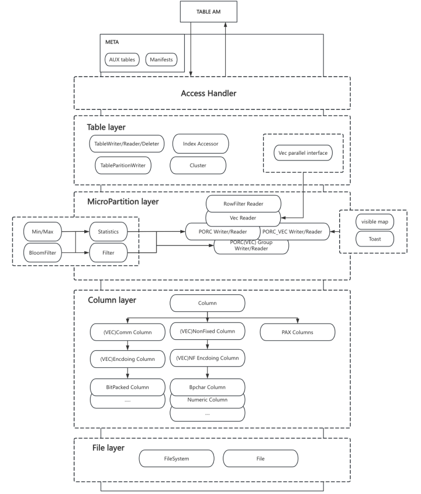

# DEV README

## Overview

Before reading this document, please make sure you have read the README.md.

In this document, we will introduce the architecture, module design, implementation details, and considerations for developers of PAX.

## Architecture

The directory structure:

```
/
├── src/
│   ├── api/               # API for the other modules
│   ├── cpp/               # Core source
│   │   ├── access/        # Table access layer
│   │   ├── catalog        # Catalog layer
│   │   ├── clustering/    # Cluster
│   │   ├── cmake/         # CMake files in subdirectory
│   │   ├── comm/          # Tools or global
│   │   ├── contrib/       # Third-party libraries
│   │   ├── manifest/      # The manifest catalog implementation 
│   │   ├── storage/       # Main storage implementation 
│   │   │   ├── columns/   # Column layer
│   │   │   ├── filter/    # Column projection  && sparse filter && row filter
│   │   │   ├── oper/      # Operator implementation
│   │   │   ├── orc/       # Storage format implementation
│   │   │   ├── proto/     # Protobuf defined
│   │   │   ├── toast/     # Implementation of toast
│   │   │   ├── tools/     # Implementation of utility functions
│   │   │   ├── vec/       # Implementation of interface of vectorized executor
│   │   │   ├── wal/       # Implementation of interface of WAL log
│   │   │   └── ...        # The interface of microparition layer
│   │   └── ...            # The interface of different layer
│   └── test/              # Regression tests
├── sql/                   # SQL tests
├── expected/              # The expected files for the SQL tests
├── hd-ci                  # CI related 
├── tools/                 # Tools for build or code inspection
└── ...                    # Build script && test related && README
```

### Layer



- Access Handler Layer: Top layer. The implementation of the access method. 
- Table Layer: For table-level read/write/update/delete
- Micro-Partition Layer: For the single file-level and group-level read/write/update/delete. Statistics and filtering are also implemented at this layer.
- Column Layer: In-memory abstraction of columns
- File Layer：In-memory abstraction of file systems

## Meta data

PAX has two implementations for the catalog:

- Auxiliary table: Use HEAP to implements the auxiliary tables. HEAP will provide MVCC.
- Manifest: Use JSON to store metadata, independent MVCC implementation. Better readability, but DDL often leads to poor performance.

Users need to specify which catalog type during compilation.

More details in `README.catalog.md`.

## Data

PAX has two storage formats:

- `PORC`: The storage format is suitable for Cloudberry executors. No format conversion is required for writing or reading by Cloudberry executors. However, format conversion is required when reading by vectorized executors.
- `PORC_VEC`: The storage format is suitable for vectorized executors. Data format conversion is required during writing, and the format needs to be converted when the Cloudberry executor reads. However, the format conversion is not required when the vectorized executor reads.

More details in `README.format.md`.


