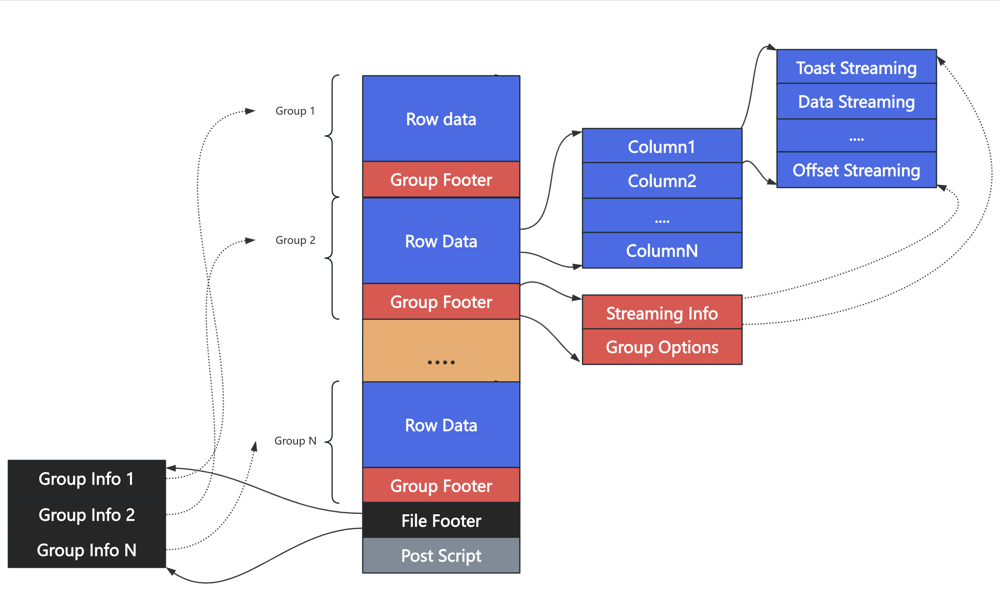

# PAX Storage Format

# Overview

PAX's storage format is derived from ORC (`liborc.so` used in the initial version). However, due to many design conflicts between the PAX and the ORC format, we decided to change ORC(Only `protobuf` part) into a `PORC` format which is more suitable for the Cloudberry. On this basis, `PORC_VEC` was created for use in the vectorized executor.

## File composition

Before I introduce the specific format, let's take a look at the composition of a PAX file.



### Post Script 

The `Post Script` records the basic information of the current file:

- Current file version
- Location of the filter footer

The `Post Script` is stored at the bottom of the file with a fixed length. When PAX opens a PAX file, it must first open the `Post Script` section to read the global information.

```
message PostScript {
  // Current PORC version 
  required uint32 majorVersion = 1;
  required uint32 minorVersion = 2;

  // each implementation that writes ORC files should register for a code
  //  1 = ORC C++
  optional uint32 writer = 3;

  // the length(bytes) of footer
  optional uint64 footerLength = 4;

  // leave this last in the record
  optional string magic = 8000;
}
```

### File Footer

The `File Footer` is stored on the upper of `Post Script`.

- Length of File Footer
- The information of the group 
  - Offset and length of the group 
  - Statistics
  - Summary information
- The basic column information
- ...

All statistics and group information are in the `File Footer`. When sparse filtering is enabled, PAX can use the `File Footer` to decide which groups do not need to be read.

```

message StripeInformation {
  // the global file offset of the start of the stripe
  optional uint64 offset = 1;
  // the number of bytes of data
  optional uint64 dataLength = 2;
  // the number of bytes in the stripe footer
  optional uint64 footerLength = 3;
  // the number of rows in this stripe
  optional uint64 numberOfRows = 4;
  // the statistics of current stripe
  repeated ColumnStatistics colStats = 5;
  // the global toast file(not this one) offset
  // of the start of the stripe
  optional uint64 toastOffset = 6;
  //the number of bytes of toast data
  optional uint64 toastLength = 7;
  //the number of toast
  optional uint64 numberOfToast = 8;
  //the external toast length of column
  repeated uint64 extToastLength = 9;
}

message Footer {
  // the length(byte) of content
  optional uint64 contentLength = 1;

  // the information of stripes
  repeated StripeInformation stripes = 2;

  // the schema descibe
  repeated Type types = 3;
  optional uint64 numberOfRows = 4;

  // all group info
  repeated pax.stats.ColumnBasicInfo colInfo = 5;

  // the data format id in stream
  // 1: origin format
  // 2: vec format
  required uint32 storageFormat = 6;
}
```

### Group 

Group contains two parts: Row data and Group footer. All inserted data will exist in the `Group`. A group consists of multiple streams of different or the same types. The stream position is recorded in the group footer.

```
// `Stream` desc a part of buffer, a column consists of 1 or more streams
// the mapping of stream to column is not strictly divided.
// the kind of each column and its last stream must be `DATA`
message Stream {
  // if you add new index stream kinds, you need to make sure to update
  // StreamName to ensure it is added to the stripe in the right area
  enum Kind {
    // null stream
    PRESENT = 0;
    // raw buffer stream
    DATA = 1;
    // length buffer stream
    LENGTH = 2;
    // toast indexes stream
    TOAST = 3;
  }
  // the kind of stream
  optional Kind kind = 1;
  // the number of entry in stream
  optional uint32 column = 2;
  // the bytes of stream
  optional uint64 length = 101;
  // the bytes of padding.
  // The length stream is placed before the data stream. When the data stream
  // of column specifies align size, the length stream may add padding bytes 
  // to ensure that the data stream is aligned according to the align size.
  optional uint32 padding = 102;
}

message StripeFooter {
  repeated Stream streams = 1;
  repeated pax.ColumnEncoding pax_col_encodings = 2;
}
```

## Format

PAX has two storage formats: PORC and PORC_VEC

- `PORC`: The storage format is suitable for Cloudberry executors. No format conversion is required for writing or reading by Cloudberry executors. However, format conversion is required when reading by vectorized executors.
- `PORC_VEC`: The storage format is suitable for vectorized executors. Data format conversion is required during writing, and the format needs to be converted when the Cloudberry executor reads. However, the format conversion is not required when the vectorized executor reads.

The file composition of these two formats is the same. Also, the streaming type is the same, but the data stored in the streaming is different.

### PORC

The streaming of the fixed-length column:

- Row data: No fill for null values.
- Null bitmap: bits map, not exist if not null in column

The streaming of the non-fixed-length column:

- Row data: No fill for null values. 
  - Each Row will be aligned with `typalign`.
  - Each Row will store the header(`varlena` header).
- Offset array: record the offset of each row
- Null bitmap: bits map, not exists if not null in column
- Toast streaming: record toast information, if toast exists

### PORC_VEC

The streaming of the non-fixed-length column:

- Row data: fill the the null values.
- Null bitmap: bits map, not exists if not null in column

The streaming of the non-fixed-length column:

- Row data: No fill for null values. 
  - Won't align.
  - Store the raw DATUM(without header).
- Offset array: record the offset of each row
- Null bitmap: bits map, not exists if not null in column
- Toast streaming: record toast information, if toast exists

